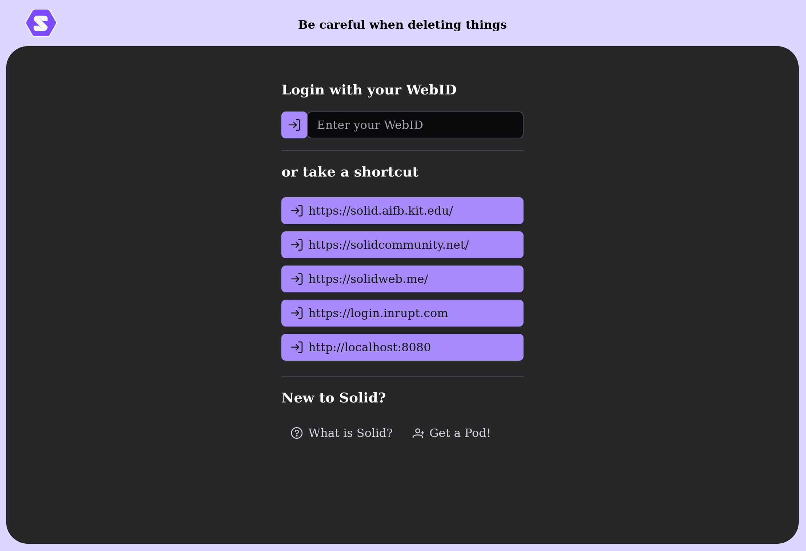
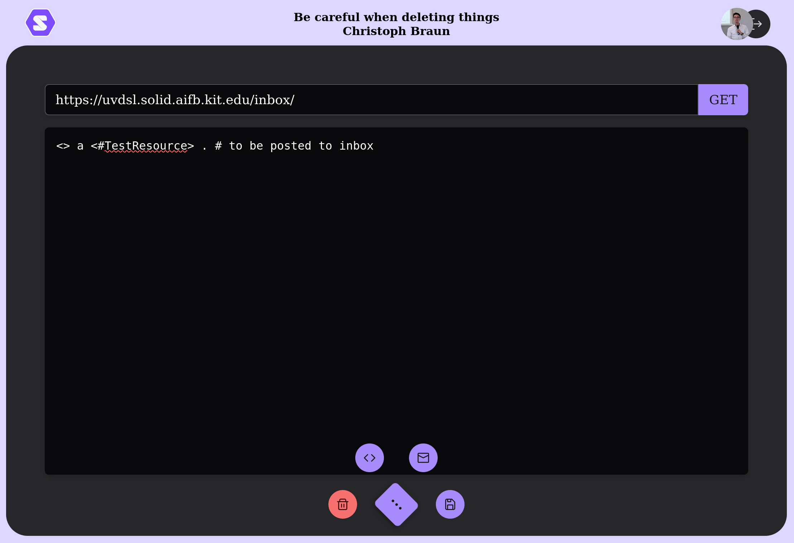
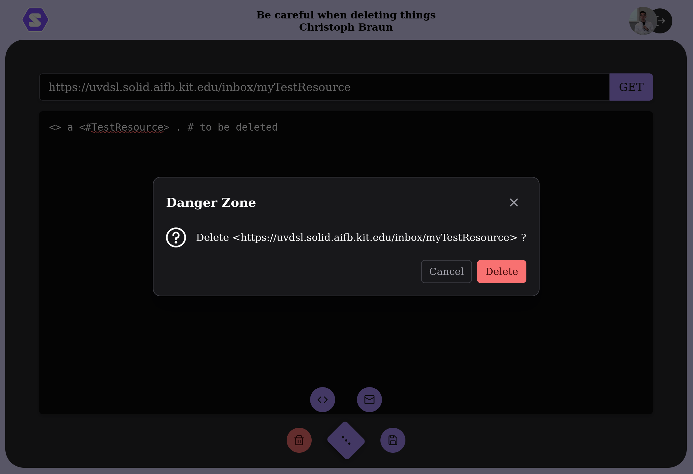

# Solid - Test - App

Creating, modifying, seeing and resources on Solid. 

This is a simple testing app, simply based on my [Solid App Template Vue](https://github.com/uvdsl/solid-app-template-vue).






## Project setup
```bash
npm install
````

### Compiles and hot-reloads for development

```bash
npm run dev
```

### Compiles and minifies for production

```bash
npm run build
```

### Preview production build locally

```bash
npm run preview
```

## Build and run using Docker

```bash
docker build -t solid-test-app:latest .
docker run -d -p 8080:80 --name SOLID-TEST-APP solid-test-app:latest
```
